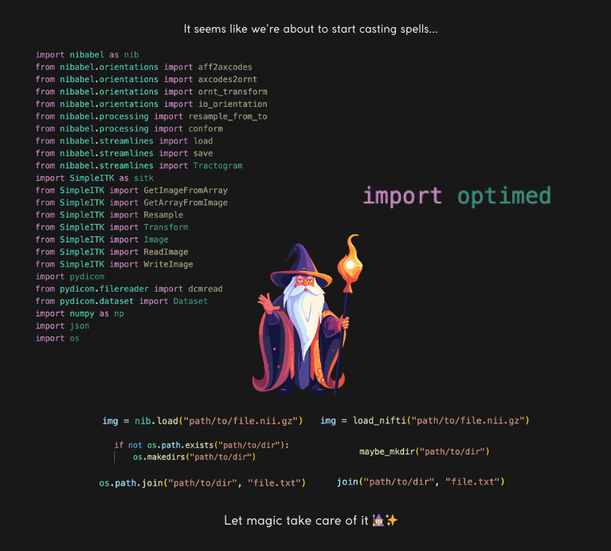

# Optimed


Señor, it seems you're a senior too!
Tired of endlessly writing the same lines of code? Repeating imports over and over? Looking for a way to optimize your project? Congratulations, my friend, you're in the same boat as us! We're also exhausted from the monotonous code—our fingers ache, and our eyes are begging for mercy.

Optimed is made just for you. It will handle all the repetitive tasks, refresh your project, and make it more readable and concise.

# Features

At the moment, key wrapper functions for NIfTI files, NumPy, and file system operations have been implemented. You can explore the functions of each module in detail here.

# Requirements

A computer, a desire, and a need.


# Installation

Run the following command to install Optimed:

```bash
pip install optimed
```

# Usage

After installing the `optimed` module, you'll be able to use the functions implemented in the project.

Here's an example of usage:

```python
from optimed.wrappers.nifti import *

img = load_nifti(file="local/ct.nii.gz", engine="nibabel")

orientation = get_image_orientation(
    img=img,
    engine='nibabel'
)

print(f"Image orientation: {orientation}")
```

This example demonstrates how to load a NIfTI file and retrieve its orientation using the `optimed` module.

# Contributing

We welcome any contributions! If you have ideas for new features or want to improve what's already there, don't hesitate—open a PR and let's make this project better together!

# License

This project is licensed under the Apache 2.0 License.

By the way, if by chance you ever run into me on the street, in a café, hotel, airport, or bar, I’d be happy if you bought me a beer!
